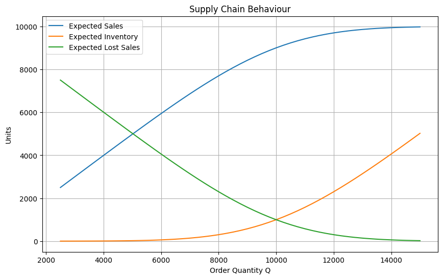
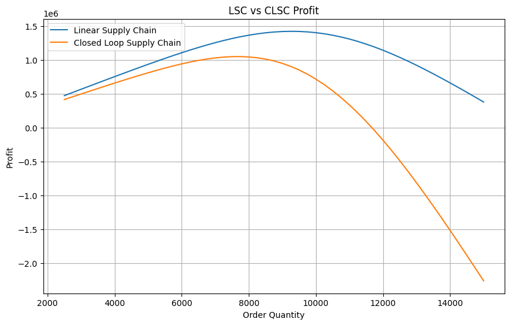

# AI-Driven Circular Supply Chain Optimization

> Decision Intelligence framework for optimizing Circular Supply Chains using Machine Learning, Operations Research, Reverse Logistics, and Sustainability Analytics.

---

## Overview

Traditional supply chains largely follow a linear model:

**Take → Make → Use → Dispose**

While effective in driving production and sales, this model often results in:

* Excess inventory and waste generation
* Resource depletion
* High carbon emissions
* Inefficient reverse logistics
* Increased dependence on virgin raw materials

This project explores how Circular Supply Chains can transform waste into recoverable economic value through data-driven decision making.

The long-term objective is to build a Decision Intelligence framework that integrates:

* Machine Learning
* Operations Research
* Multi-objective Optimization
* Reverse Logistics
* Sustainability Analytics

to support intelligent and sustainable supply chain decisions.

---

## Problem Statement

Most inventory management systems optimize profit without explicitly accounting for product recovery, reuse, recycling, or sustainability costs.

Circular Supply Chains introduce new challenges:

* How much inventory should be produced?
* What is the optimal trade-off between profit and sustainability?
* How can reverse logistics be incorporated into inventory decisions?
* How can waste be reduced while maintaining operational efficiency?

This project aims to address these questions through optimization and analytics.

---

## Current Implementation

### Phase 1: Closed Loop Supply Chain Model

Implemented:

* Expected Sales Analysis
* Expected Inventory Analysis
* Expected Lost Sales Analysis
* Linear Supply Chain (LSC) Profit Model
* Closed Loop Supply Chain (CLSC) Profit Model
* Profit Comparison Visualization
* Supply Chain Behaviour Analysis

Notebook:

```text
notebooks/
└── 01_Closed_Loop_Supply_Chain_Model.ipynb
```

---

## Results

### Supply Chain Behaviour

The graph below illustrates the relationship between:

* Expected Sales
* Expected Inventory
* Expected Lost Sales

as the order quantity changes.



### Linear vs Closed Loop Supply Chain Profit

The graph below compares the profitability of a traditional Linear Supply Chain and a Closed Loop Supply Chain.



### Key Insights

* Expected sales increase with order quantity.
* Expected lost sales decrease as inventory availability increases.
* Excess inventory grows rapidly at higher order quantities.
* The Closed Loop Supply Chain reaches optimal profit at a lower inventory level than the Linear Supply Chain.
* Circularity introduces recovery and collection costs, creating a trade-off between profitability and sustainability.

---

## Project Roadmap

### Phase 1 — Closed Loop Supply Chain Model

* [x] Literature Review
* [x] Inventory Optimization Model
* [x] Profit Analysis
* [x] Visualization

### Phase 2 — Predictive Analytics

* [ ] Demand Forecasting
* [ ] Product Return Prediction
* [ ] Recovery Value Prediction

### Phase 3 — Multi-Objective Optimization

* [ ] Cost Minimization
* [ ] Carbon Emission Minimization
* [ ] Recovery Value Maximization

### Phase 4 — Decision Intelligence Engine

* [ ] Intelligent Recovery Recommendations
* [ ] Scenario Analysis
* [ ] Decision Support Framework

### Phase 5 — Dashboard Development

* [ ] Interactive Dashboard
* [ ] Sustainability KPIs
* [ ] Executive Decision Support

---

## Repository Structure

```text
AI-Driven-Circular-Supply-Chain-Optimization/
│
├── README.md
│
├── notebooks/
│   └── 01_Closed_Loop_Supply_Chain_Model.ipynb
│
├── results/
│   ├── supply_chain_behaviour.png
│   └── lsc_vs_clsc_profit.png
│
├── docs/
│
├── data/
│
└── src/
```

---

## Tech Stack

### Programming

* Python

### Data Analysis

* Pandas
* NumPy

### Optimization

* OR-Tools
* PuLP
* CPLEX (planned)

### Machine Learning

* Scikit-Learn
* XGBoost (planned)

### Visualization

* Matplotlib
* Plotly
* Streamlit (planned)

---

## Research Areas

* Circular Economy
* Supply Chain Analytics
* Operations Research
* Reverse Logistics
* Sustainability Analytics
* Industrial AI
* Decision Intelligence
* Multi-Objective Optimization

---

## Future Scope

Potential extensions include:

* Digital Twin Supply Chains
* Reinforcement Learning for Dynamic Decisions
* Carbon Credit Optimization
* IoT-enabled Product Tracking
* ESG Performance Analytics
* Industrial Decision Intelligence Systems

---
